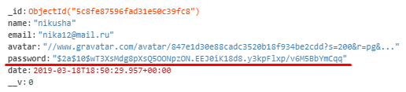

# Eden of Gaming
Welcome to Online games e-commerce shop done for Techub DC as a final project
# What have we done
 * We have built an online-games ecommerce website where games are delivered instantly via cd-key format.
 * We initially wanted to make it social network + e-commerce mix but because of lack of time we couldn't make it happen but backend part of it is done
 * Security - in the picture below you can see that even the admin of the database can't see user's password backend developer has used bcrypt and her salt built generated hashes in order to prevent rainbow attacks from outside as well and the salt can't really be encrypted 
* 
* User register validation is secured from back-end
* User login validation is secured from back-end as well and whenever user logs in he gets a Web-token active for 48hours
* Protected routes as well public ones
* Games can be filtered by category and platform
* User can create public profile
* Application has it's own local profile pictures folder - /uploads, individual picture is saved in MongoDB database
* <b>Powerful Shopping Cart - User will be proposed similar item on checkout based on it's genre</b>
* <b>Instant product delivery - Game's cdkey will be delivered instantly upon purchase</b>
* Customer support - any user can message the admin for support
## Admin Features
* to login as admin use "email: admin@admin.com, password: admin123",
* Admin sees total users and their average age
* Admin can change any user's name
* Admin can see user's cart items if there are any
* Admin can add games and delete them
* Admin can change game's image/trailer/description/price etc.
* Admin can reply to user's correspondence or can start one

# Team Members
* Tornike Gagadze     - Front-end   - React.js
* Boris Mirtskhulava  - Backend     - Node.js and MongoDB
* Vakho Naroushvili   - Initially Backend and than Front-end - React.js
* Irakli Akhobadze    - Markup      - HTML/CSS/SCSS
   

## How to open

you can download our project from this page by clicking "Clone or download" button

# Install Packages

at first dowload and install node.js 
this is a mern stack app, so 
you need to install packages for both
it will take few minutes

## Install back-end packages

open our project folder in any terminal and type

```bash
npm install
```

## Install client side packages

type in terminal

```bash
cd ./client && npm install
```

## Run application

type in terminal

```bash
npm run dev
```

this command starts our application
first start may take few minutes

# Technologies used

1) HTML
2) CSS
3) SCSS
4) Javascript
5) React
6) Node.js
7) MongoDB

# Packages used

```JSON
"clientSide": {
    "axios": "^0.18.0",
    "classnames": "^2.2.6",
    "jwt-decode": "^2.2.0",
    "node-sass": "^4.11.0",
    "react": "^16.8.4",
    "react-dom": "^16.8.4",
    "react-file-reader": "^1.1.4",
    "react-router-dom": "^4.3.1",
    "react-scripts": "^2.1.8",
    "react-slick": "^0.23.2",
    "styled-components": "^4.1.3"
},
"backend": {
    "axios": "^0.18.0",
    "bcryptjs": "^2.4.3",
    "body-parser": "^1.18.3",
    "concurrently": "^4.1.0",
    "cors": "^2.8.5",
    "express": "^4.16.4",
    "gravatar": "^1.8.0",
    "jsonwebtoken": "^8.5.0",
    "jwt-decode": "^2.2.0",
    "mongoose": "^5.4.19",
    "multer": "^1.4.1",
    "nocache": "^2.0.0",
    "nodemon": "^1.18.10",
    "on-headers": "^1.0.2",
    "passport": "^0.4.0",
    "passport-jwt": "^4.0.0",
    "validator": "^10.11.0"
}
```
